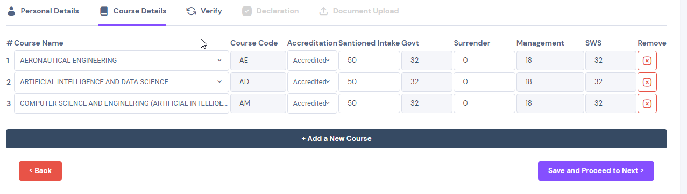
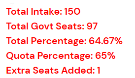
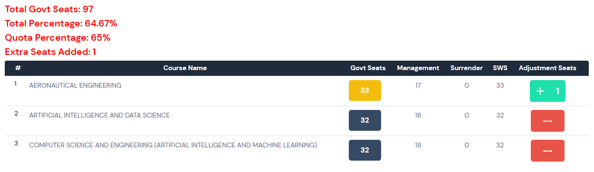

# Schema

## Database Schema

```js
{
    ccode: {
      description:"COLLEGE CODE",
      type: String,
      required: true,
    },
    CollegePassword: {
      description:"LOGIN PASSWORD",
      type: String,
      required: true,

    },
    can: {
      description:"COLLEGE NAME",
      type: String,
      required: false,
    },
    Category: {
      description:" COLLEGE CATEGORY",
      type: String,
      required: false,
    },
    Email: {
      description:" COLLEGE EMAIL",
      type: String,
      required: false,
      default: "",
    },
    PrincipalName: {
      description:" COLLEGE PRINCIPAL NAME",
      type: String,
      required: false,
      default: "",
    },
    PhoneNumber: {
      description:" COLLEGE PHONE NUMBER",
      type: String,
      required: false,
      default: "",
    },
    Pincode: {
      description:" COLLEGE PINCODE",
      type: String,
      required: false,
      default: "",
    },
    District: {
      description:" COLLEGE DISTRICT",
      type: String,
      required: false,
      default: "",
    },
    Website: {
      description:" COLLEGE OFFICIAL WEBSITE",
      type: String,
      required: false,
      default: "",
    },
    Autonomous: {
      description:" COLLEGE AUTONOMOUS STATUS",
      type: Boolean,
      required: false,
    },
    PersonalDetailFlag: {
      description:" FLAG TO CHECK IF THEY COMPLETED PERSONAL DETAILS ",
      type: Boolean,
      required: false,
    },
    CourseDetails: {
      description:" ARRAY OF OBJECTS to store Course Details",
      required: false,
      type: Object,
      default: [],
    },
    CourseDetailFlag: {
      description:" FLAG TO CHECK IF THEY COMPLETED COURSE DETAILS SECTION ",
      type: Boolean,
      required: false,
    },
    DeclarationFlag: {
      description:" FLAG TO CHECK IF THEY COMPLETED DECLARATION SECTION ",
      type: Boolean,
      required: false,
    },
    Documents: {
      description:" STORES THE DOCUMENT RELATED INFORMATION",
      type: Object,
      required: false,
    },
    DocumentUploadFlag: {
      description:" FLAG TO CHECK IF THEY UPLOADED REQUIRED DOCUMENT DETAILS ",
      type: Boolean,
      required: false,
    },
    Freeze1: {
      description:"FLAG TO CHECK IF THEY FROZEN PHASE 1 DATA COLLECTION(PERSONAL DETAILS, COURSE DETAILS AND VERIFICATION)",
      type: Boolean,
      required: false,
    }
}
```

## Course Details Schema

```js
courseSchema = {
    courseName: {
      description:"COURSE NAME",
      type: String,
      required: true,
    }
    courseCode:{
      description:"COURSE CODE",
      type: String,
      required: true,
    },
    accredation: {
      description:"COURSE Accredation",
      type: Boolean,
      required: false,
    },
    intake: {
      description:"OVERALL INTAKE",
      type: Number,
      required: true,
    },
    Govt: {
      description:"GOVERNMENT SEATS",
      type: Number,
      required: true,
    },
    Surrender: {
      description:"SURRENDERED SEATS",
      type: Number,
      required: true,
    },
    Management: {
      description:"MANAGEMENT SEATS",
      type: Number,
      required: true,
    },
    SWS: {
      description:"GOVERNMENT SEATS+SURRENDERED SEATS",
      type: Number,
      required: true,
    },
    Quota: {
      description:"% OF GOVERNMENT SEAT",
      type: Number,
      required: true,
    },
    Added: {
      description:"TOTAL NUMBER OF SEATS ADDED TO ADJUST THE GOVT QUOTA",
      type: Number,
      required: true,
    },,
    Pending: {
      description:"FRACTIONAL PENDING OF SEATS AFTER FLOORING",
      type: Number,
      required: true,
    }
  };
```

## Government Quota Percentage

```js
const GOVTSeats = {
  "CENTRAL GOVT": 0.5,
  "CHRISTIAN": 0.5,
  "GOVT": 1,
  "GOVT AIDED": 1,
  "HINDI": 0.5,
  "JAIN": 0.5,
  "MALAYALAM": 0.5,
  "MALAYALAM LINGUISTIC": 0.5,
  "MIN": 0.5,
  "MUSLIM": 0.5,
  "NM": 0.65,
  "SOWRASHTRA": 0.5,
  "TELUGU": 0.5,
  "UNIV": 1,
  "IRTT": 0.65,
  "SS": 0.7,
};
```

## Algorithm To Adjust the Government Seats

### Step 1: Calculate Government and Management Seat

```md
Government Seat = floor(Total Intake*GOVTSeats[Category])
Management Seat = Total Intake - Government Seat
```



### Step 2: Finding the Total Seats formed from Fraction

```md
SeatsToAdd = Sum of all Fractional Values in each Course
```



### Step 3: Finding the Eligible Courses to Distirbute the remaining seats

```js
if(Course.Quota !== 1 && Course.Management > 0)
{
    eligibleCourse.push(Course);
}
```

### Step 4: Ranking the Course to Distribute the Remaining Seats

```md
Priority 1: Based on the course that have highest pending value
======================================================================
Priority 2 (In case of Any two eligbile Course have same pending value):
Courses with same Priority value will be ranked based on the previous year minimum rank data. 
the course with minimum rank in each college will be given a higher preference to distribute the seat
[Course Rank for each Collage](../client/src/utils/CourseRank.js)
======================================================================
Priority 3: In case if the college offers a new course, then the new course will be given priority
```

### Step 5: Distributing the Seats Based on the Rank

```md
Repeats Step 4 untill
1. No seats are left to distribute
OR 
2. No Elegible Courses to distribute
```


